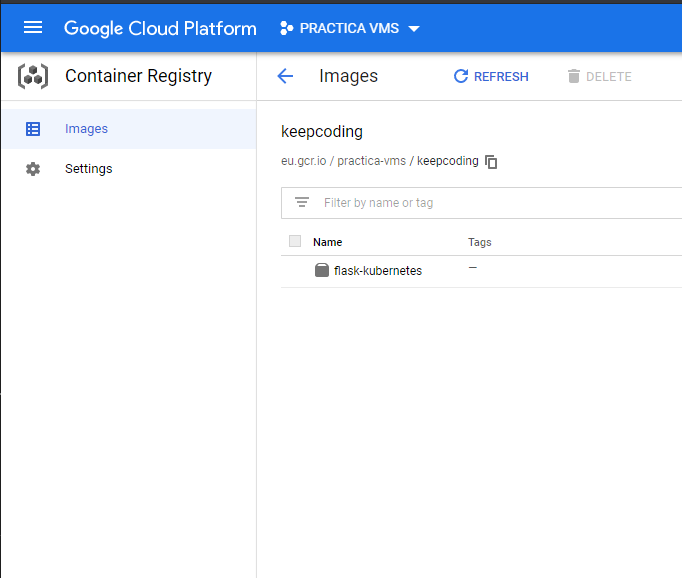
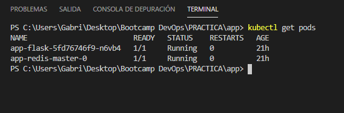
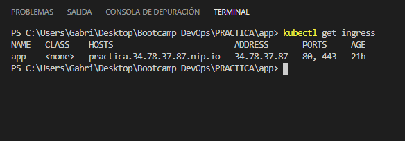
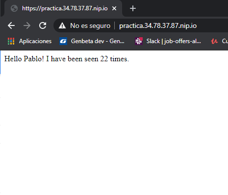

# PRÁCTICA FINAL CONTENEDORES-VMS

Práctica del Bootcamp DevOps III de Keepcoding.

## REQUISITOS

- Docker.

- Cuenta en GCP.

- Kubernetes.

- Minikube.

- Git.

- Helm.

## DESCRIPCIÓN DE LA PRÁCTICA

El objetivo de la práctica propuesta es deplegar una aplicación (micro servicio) que lea y escriba en una base de datos.

Se ha escogido la aplicación flask-counter vista en clase, ligeramente retocada :)

## DOCKERFILE MULTISTAGE

Lo primero que debemos hacer es crear el fichero Dockerfile de la manera más optimizada para poder construir la app.

Primero, creamos el archivo vacio ```requirements.txt``` 

Una vez creado, crearemos el ```Dockerfile``` de la siguiente manera:

```dockerfile
FROM python:3.7-alpine as base  --> Definimos la imagen

FROM base AS dependencies

WORKDIR /install

RUN apk add --no-cache gcc musl-dev linux-headers  --> Instalamos dependencias requeridas para las dependencias
COPY requirements.txt /requirements.txt
RUN pip install --prefix=/install -r /requirements.txt  --> Instalamos dependencias en requirements.txt

FROM base

COPY --from=dependencies /install /usr/local

WORKDIR /app
COPY . .
----------------------------> Variables de entorno
ENV FLASK_APP app.py
ENV FLASK_RUN_HOST 0.0.0.0
ENV REDIS_HOST "redis"
ENV REDIS_PORT "6379"
ENV REDIS_PASSWORD ""

EXPOSE 5000

CMD ["flask", "run"]
```
`NOTA:` Para que el Dockerfile sea valido debemos borrar antes las instrucciones precedidas de -->. El fichero original podremos encontrarlo en [`app/src/Dockerfile`](app/src/Dockerfile). 

## APP

El siguiente paso será crear nuestra app. Para la práctica hemos escogido la aplicación ```FLASK``` utilizada en el modulo a la que le hemos añadido una pequeña modificación.

## DOCKER-COMPOSE

Para ayudarnos con la construcción de nuestros recursos, y comprimirlos en un sólo paso, crearemos un fichero ```docker-compose.yaml``` de la siguiente manera:

```yaml
version: "2.0"
services:
  app:
  # Construcción del contenedor
    build: .  

  # Creamos docker-network
    ports:
      - "5000:5000"

  # Enlazamos nuestra imagen redis al docker-network
    links:
      - redis

  # Indicamos imagen para contenedor
  redis:
    image: redis
```

De esta manera, ejecutando ```docker-compose.yaml```, construiremos nuestro contenedor con todas sus dependencias con sólo un comando.

Si navegamos a http://localhost:5000 podremos acceder a él.

## LOGS JSON

Para configurar los logs de nuestra aplicación, utilizaremos la biblioteca ```json-loggin-python```.

Los pasos a seguir son:

En nuestro requirements.txt, añadir:

```json_logging```

En app.py, añadiremos la dependencia para poder utilizarla, y posteriormente la incializaremos:

```python
import logging, sys, json_logging

json_logging.init_flask(enable_json=True)
json_logging.init_request_instrument(app)

# init the logger as usual
logger = logging.getLogger("logger")
logger.setLevel(logging.DEBUG)
logger.addHandler(logging.StreamHandler(sys.stdout))
```

## APLICACIÓN CONFIGURABLE

Para poder hacer que nuestra aplicación sea configurable y pueda ser utilizada en cualquier sitio, definiremos los valores configurables en nuestro fichero ```app.py``` y en nuestro ```Dockerfile``` de la siguiente manera:

```app.py```
```python
# Definimos nuestras variables de entorno
REDIS_HOST = os.environ['REDIS_HOST']
REDIS_PORT = os.environ['REDIS_PORT']
REDIS_PASSWORD = os.environ['REDIS_PASSWORD']

# Utiliamos las variables definidas
cache = redis.Redis(host=REDIS_HOST, port=int(REDIS_PORT), password=REDIS_PASSWORD)
```

```Dockerfile```

```dockerfile
#Definimos las variables de la app y le damos un valor por defecto
ENV REDIS_HOST "redis"
ENV REDIS_PORT "6379"
ENV REDIS_PASSWORD ""
```

## KUBERNETES

Para desplegar nuestra aplicación en kubernetes, comenzaremos por crear el fichero `app/k8s`, donde crearemos los manifest.

### app-deployment
 
Comenzaremos por crear el deployment, al que hemos llamado `app-deployment.yaml`, donde definiremos la configuración de los PODs. 

Primero tenemos que tener alojada nuestra app en alguna plataforma. En este caso hemos escogido gcp.

Si aun no tenemos cuenta, lo primero será crearla junto con un nuevo proyecto. Una vez creada, debemos crear un cluster de Kubernetes.

En nuestro caso, como nombre de proyecto tenemos `practica-vms`, y hemos creado el cluster `keepcoding`.

Subiremos principalmente nuestra imagen a dockerhub mediante los siguientes comandos:

```bash
docker build -t flask-kubernetes .
docker tag flask-kubernetes NOMBRE_USUARIO(gmaillo)/flask-kubernetes
docker login
docker push gmaillo/flask-kubernetes
```

Una vez subida, en el apartado `image` de app-deployment, pondremos nuestra imagen Docker. En este caso quedaría así:

```image: gmaillo/flask-kubernetes```

Es el momento de conectar nuestro cluster de gcp a nuestro directorio local. Para ello usaremos el comando:

```gcloud container clusters get-credentials keepcoding --zone europe-west1-d --project practica-vms```

Donde se incluye el nombre de proyecto y del cluster.

Ahora desde la shell, creamos un docker tag dandole un nombre de registry de google:

```docker tag flask-kubernetes eu.gcr.io/practica-vms/keepcoding/flask-kubernetes```

Y haremos un push para subir la imagen al container registry de google (privada por defecto):
```docker push eu.gcr.io/practica-vms/keepcoding/flask-kubernetes```



Modificamos el apartado image del app-deployment quedando de esta manera:

```eu.gcr.io/practica-vms/keepcoding/flask-kubernetes:latest```

### configmap

Fichero app-configmap.yaml donde incluiremos las opciones de configuración:

```yaml
apiVersion: v1
data:
  redis.host: redis
  redis.port: "6379"
kind: ConfigMap
metadata:
  name: app-config
```

### secret

Para generar el secret(no incluido en el repositorio) utilizaríamos el comando:

```kubectl create secret generic redis --from-literal=password=secret```

Con lo que creariamos el secreto llamado redis, con un password y valor secret.

### service

Fichero app-svc.yaml que hará de balanceador interno.

````yaml
apiVersion: v1
kind: Service
metadata:
  labels:
    run: flask
  name: flask
spec:
  ports:
  - port: 5000
    protocol: TCP
    targetPort: 5000
  selector:
    run: flask
  type: ClusterIP

````

### ingress

Fichero app-ingress.yaml que expondrá la aplicación a internet. Configuramos Wildcard DNS para la prueba.

````yaml
apiVersion: extensions/v1beta1
kind: Ingress
metadata:
  annotations:
    kubernetes.io/ingress.class: nginx
  name: flask
spec:
  rules:
  - host: practica.34.78.37.87.nip.io
    http:
      paths:
      - backend:
          serviceName: flask
          servicePort: 5000

````

### redis-deployment

Fichero redis-deployment.yaml que configuraremos para que tenga autenticación, proporcione contraseña como secreto y tenga persistencia.

````yaml
        args: ["--requirepass", "$(REDIS_PASS)"]
        env:
          - name: REDIS_PASS
            valueFrom:
              secretKeyRef:
                name: redis
                key: password
        resources:
          requests:
            memory: 128Mi
            cpu: 100m
          limits:
            memory: 256Mi
            cpu: 200m
        volumeMounts:
        - name: data
          mountPath: /data
      volumes:
        - name: data
          persistentVolumeClaim:
            claimName: redis-pv-claim

````

### redis-pvc PERSISTENT VOLUME CLAIM

Fichero redis-pvc.yaml que solicitará al cluster que haya un volumen persistente disponible de 20Gb.

````yaml
apiVersion: v1
kind: PersistentVolumeClaim
metadata:
  name: redis-pv-claim
  labels:
    app: redis
spec:
  accessModes:
    - ReadWriteOnce
  resources:
    requests:
      storage: 20Gi
````

### redis-service

Fichero redis-service para que nuestra app pueda conectarse a redis.

````yaml
apiVersion: v1
kind: Service
metadata:
  labels:
    run: redis
  name: redis
spec:
  ports:
  - port: 6379
    protocol: TCP
    targetPort: 6379
  selector:
    run: redis
  type: ClusterIP

````

## HELM

Para generar un chart de helm, comenzaremos por crear un directorio `chart/app` dentro de nuestra app.

### Chart.yaml

En el fichero Chart.yaml le indicamos que nuestra aplicación depende de redis, y añadimos la ruta de su repositorio público.

```yaml
apiVersion: v1
description: Aplicación
name: app
version: 1.0.0
dependencies:
- name: redis
  version: 10.5.7
  repository: https://charts.helm.sh/stable
  condition: redis.enabled
```
### values.yaml

En este fichero nos encontraremos todas las opciones de configuración de la app.

```yaml
replicas: 1
image:
  name: eu.gcr.io/practica-vms/keepcoding/flask-kubernetes:latest
  tag: v1.3.0
resources:
  requests:
    memory: 128Mi
    cpu: 100m
  limits:
    memory: 256Mi
    cpu: 200m

ingress:
  enabled: true
  annotations:
    kubernetes.io/ingress.class: nginx
  hosts:
    - host: practica.34.78.37.87.nip.io
      paths:
      - "/"

redis:
  cluster:
    enabled: false
```

### secret

Para generar el secreto, el chart de redis lo genera automáticamente. Desde la app hacemos referencia al secreto creado por el chart de redis:

```yaml
env:
- name: REDIS_PASSWORD
  valueFrom:
      secretKeyRef:
         name: {{ template "app.name" . }}-redis
         key: redis-password
```

## Asegurar que los PODs de la base de datos y la aplicación permanecen lo más juntos posible

Mediante `inter-pod affinity` le indicamos al scheduler de Kubernetes nuestra preferencia para que los PODs esten los más cerca posible.

```yaml
affinity:
        podAffinity:
          preferredDuringSchedulingIgnoredDuringExecution:
          - weight: 100
            podAffinityTerm:  
              labelSelector:
                matchExpressions:
                - key: app
                  operator: In
                  values:
                  - redis
              topologyKey: "kubernetes.io/hostname"
```

## Asegurar que los PODs de las réplicas de la aplicación permanecen lo más separados posibles

Mediante el uso de reglas `inter-pod anti-affinity`, los PODs harán los posible para estar en distintos nodos.

```yaml
podAntiAffinity:
            preferredDuringSchedulingIgnoredDuringExecution:
            - weight: 100
              podAffinityTerm:  
                labelSelector:
                    matchExpressions:
                    - key: app
                      operator: In
                      values:
                      - {{ template "app.name" . }}-flask
                topologyKey: "kubernetes.io/hostname"

```

## Almacenamiento persistente provisionado de forma dinámica para la base de datos

Debemos crear en nuestro fichero redis-pvc.yaml un persistentVolumeClaim:

```yaml
apiVersion: v1
kind: PersistentVolumeClaim
metadata:
  name: redis-pv-claim
  labels:
    app: redis
spec:
  accessModes:
    - ReadWriteOnce
  resources:
    requests:
      storage: 20Gi
```
Posteriormente, en el fichero redis-deployment.yaml, haremos referencia:

```yaml
    volumeMounts:
        - name: data
          mountPath: /data
      volumes:
        - name: data
          persistentVolumeClaim:
            claimName: redis-pv-claim
```

## Configuracion externa mediante secretos y configMaps

Anteriormente indicamos que el secret no debe ser mostrado en el repositorio, para generarlo introducimos:

`kubectl create secret generic redis --from-literal=password=secret`

Y hacemos referencia a él mediante una variable de entorno:

```yaml
- name: REDIS_PASSWORD
  valueFrom:
    secretKeyRef:
      name: redis
      key: password
```

La parte de ConfigMap se referencia igualmente por variables de entorno:

```yaml
env:
- name: REDIS_HOST
valueFrom:
   configMapKeyRef:
      name: app-config
      key: redis.host
- name: REDIS_PORT
valueFrom:
   configMapKeyRef:
      name: app-config
      key: redis.port
```

## Instalar Ingress Controller: Nginx

Primero, crearemos un namespace donde instalarlo, y una vez creado, lo instalamos desde su repositorio oficial.

```shell
kubectl create namespace nginx-ingress
helm repo add ingress-nginx https://kubernetes.github.io/ingress-nginx
helm install --namespace nginx-ingress nginx-ingress ingress-nginx/ingress-nginx

```

## Exponer la aplicación públicamente mediante Ingress.

Para desplegar nuestra aplicación en el cluster, ejecutamos:

`helm install app charts/app`

Observamos con `kubectl get pods` que nuestros pods funcionan correctamente:



Con el comando `kubectl get ingress` podemos ver que nuestro Ingress se ha creado:



Para finalizar, accedemos a nuestra DNS de prueba `practica.34.78.37.87.nip.io ` (Wildcard) para comprobar que nuestra aplicación se ha desplegado y funciona correctamente:



